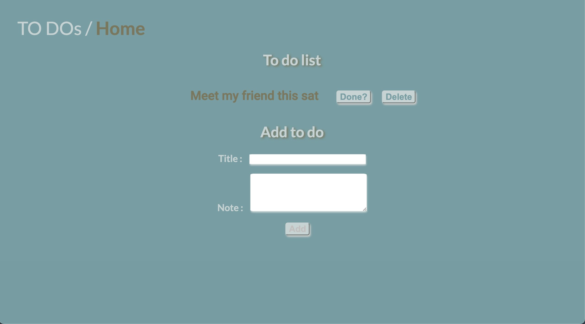
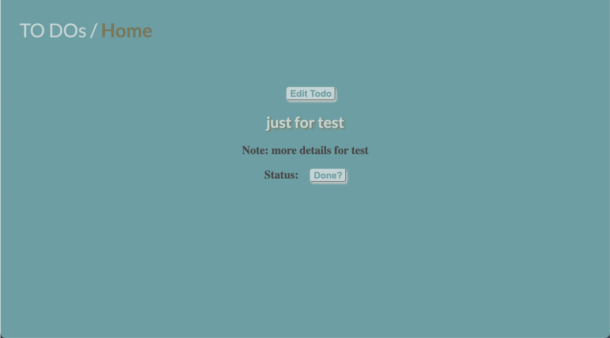
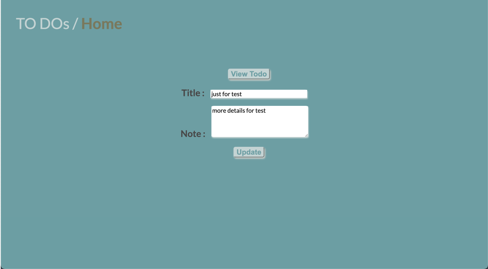

# Redux-demo(To do app)

### **Summary**

---

This Todo application utilizes Redux Toolkit to proficiently manage state within React, enabling seamless operations such as addition, deletion, editing, and presentation of todos within the user interface.

### **Technologies used**

---

- React Router
- React vite framework
- Redux toolkit / React-Redux
- Json server libary acting as backend

### **Screenshots**

---

